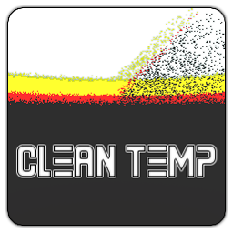
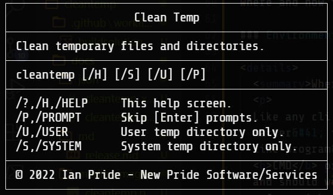

# Clean Temp

Clean temporary files and directories in Windows.&#46;

- [Clean Temp](#clean-temp)
  - [About](#about)
    - [Description](#description)
    - [Motivation](#motivation)
    - [Where To Get](#where-to-get)
    - [Change Log](#change-log)
  - [Usage](#usage)
    - [Environment and Information](#environment-and-information)
    - [Examples](#examples)
  - [MD5 Information](#md5-information)
    - [Current X86 MD5](#current-x86-md5)
    - [Current X64 MD5](#current-x64-md5)
  - [Media](#media)
  - [LICENSE](#license)

---

## About

All about this program and project&#46;

### Description

  
What is this&#63;

  

  This is a console tool for the <b>Windows</b> command line environment that deletes temporary files and directories in <code>%SYSTEMROOT%\temp</code> &#40;<i>System</i>&#41; and <code>%TEMP%</code> &#40;<i>User</i>&#41;&#46; Great for use as a <i>scheduled task</i> &#40;Task Scheduler&#41;&#46; This works in <b><i>cmd</i></b> or <b><i>PowerShell</i></b>&#46;
  

### Motivation

  
Why did I write this&#63;

  

  This helps me automate cleaning my temporary folders&#46; I&#39;ve been writing scripts to do this for years&#44; this just makes it a tad bit easier&#59; more portable&#46;
  

### Where To Get

  
Download or build&#46;

  

  You can fork this repository and build yourself or you can download it at the current <a href="https://github.com/Lateralus138/cleantemp/releases">Releases</a> page&#46;
  

### Change Log

Changes and fixes in 1.1.0.1683399661082 (1.1.0.0)

- Fixed the wait prompt for *`skip_prompt`*.
- Fixed exception throwing when indexing directories without administrative privileges.
- Fixed the console mode to correctly display console color.

---

## Usage

Where and how to use this program&#46;

### Environment and Information

  
Where do I use this&#63;

  

  Like any cli tool &#40;or any executable for that matter&#41; this can be used in any available command line program&#47;emulator in <b>Windows</b> like <b>CMD</b> or <b>PowerShell</b>&#44; for example&#44; and should work in most available terminals&#46;

  Like any portable program in this can either be placed somewhere in your <code>%PATH%</code> and if not then when your run it you&#39;ll need to provide the direct path of the executable&#46;
  

  <h4>Example Given</h4>
  <pre>
    <code> > & &#39;C:\Users\&#60;USERNAME&#62;\Bin\cleantemp.exe&#39; /&#63; </code>
  </pre>

### Examples

  
Best methods&#46;

  

  This is best used as a <i>scheduled task</i> via <i><b>Task Scheduler</b></i> with the &#91;&#47;P&#93; switch&#44; but you can use it from the command line&#44; shortcut &#40;&#46;lnk&#41;&#44; clicked&#44; or from any other program&#46;
  

  
Get Help&#46;

  
In CMD or PowerShell&#46; &#40;with /?, /H, or /HELP&#41;&#46; You can also find a screenshot below&#46;

  <pre>
    <code>C:\Windows\System32> cleantemp /?</code>
    <samp>
┌────────────────────────────────────────────────┐
│                   Clean Temp                   │
├────────────────────────────────────────────────┤
│ Clean temporary files and directories.         │
├────────────────────────────────────────────────┤
│ cleantemp [/H] [/S] [/U] [/P]                  │
├────────────────────────────────────────────────┤
│ /?,/H,/HELP     This help screen.              │
│ /P,/PROMPT      Skip [Enter] prompts.          │
│ /U,/USER        User temp directory only.      │
│ /S,/SYSTEM      System temp directory only.    │
├────────────────────────────────────────────────┤
│ © 2022 Ian Pride - New Pride Software/Services │
└────────────────────────────────────────────────┘
    </samp>
  </pre>

  
CMD Examples&#46;

  
Good old fashion cmd&#46;exe&#46;

  
Clean user temp dirctory only&#46;

  <pre>
  <code>
  C:\Windows\System32> cleantemp /U
  <samp>
┌────────────────────────────────────────────────┐
│                  Clean Temp                    │
├────────────────────────────────────────────────┤
│ Clean all temporary directories for a user.    │
└────────────────────────────────────────────────┘

┌────────────────────────────────────────────────┐
│  Found user temp directory and enumerating     │
│  children files and directories.               │
└────────────────────────────────────────────────┘

┌────────────────────────────────────────────────┐
│ Found files and folders in the user temp       │
│ directory and attempting to delete.            │
└────────────────────────────────────────────────┘

C:\Users\\<USERNAME\>\AppData\Local\Temp\027bfd2d-276b-4e2c-83b2-5f1d444c3382.tmp is in use by another process.
...
Access is denied for C:\Users\\<USERNAME\>\AppData\Local\Temp\8cd7e51b-f6be-48c9-afd0-e04c6954b9aa.tmp.node
C:\Users\\<USERNAME\>\AppData\Local\Temp\8fccf883-842d-4d9a-a21e-8cbf0b6d9f1f.tmp is in use by another process.
...
C:\Users\\<USERNAME\>\AppData\Local\Temp\qtsingleapp-qBitto-9f54-1-lockfile is in use by another process.
C:\Users\\<USERNAME\>\AppData\Local\Temp\tempoa deleted successfully.
C:\Users\\<USERNAME\>\AppData\Local\Temp\tempob deleted successfully.                       
  </samp>
  </code>
  </pre>

  
PowerShell Examples&#46;

  
The more powerful PowerShell or PWSH&#46;

  
Clean system temp dirctory only&#46;

  <pre>
  <code>
  C:\Windows\System32> cleantemp /U
  <samp>
┌────────────────────────────────────────────────┐
│                  Clean Temp                    │
├────────────────────────────────────────────────┤
│ Clean all temporary directories for a user.    │
└────────────────────────────────────────────────┘

┌────────────────────────────────────────────────┐
│ Found system temp directory and enumerating    │
│ children files and directories.                │
└────────────────────────────────────────────────┘

┌────────────────────────────────────────────────┐
│ Found files and folders in the system temp     │
│ directory and attempting to delete.            │
└────────────────────────────────────────────────┘

C:\WINDOWS\Temp\catalog.json deleted successfully.
C:\WINDOWS\Temp\INFERNO2-20220115-1352.log is in use by another process.
C:\WINDOWS\Temp\officeclicktorun.exe_streamserver(2022011513515810B8).log is in use by another process.                       
  </samp>
  </code>
  </pre>

---

## MD5 Information

This information is generated in a *GitHub Action* immediately after the successful build of this project.

### Current X86 MD5

### Current X64 MD5

---

## Media

<!-- ### Logo -->

  
Logo, the icon for this program&#46; 

  

  
Help, screenshot of the help screen&#46; 

  

<!-- ### Example Screenshots -->

---

## [LICENSE](./LICENSE)

  
License Excerpt

   
  <blockquote>
  This program is free software&#58; you can redistribute it and&#47;or modify it under the terms of the GNU General Public License as published by the Free Software Foundation&#44; either version 3 of the License&#44; or &#40;at your option&#41; any later version&#46;
  </blockquote>
   
  <blockquote>
  This program is distributed in the hope that it will be useful&#44; but WITHOUT ANY WARRANTY&#59; without even the implied warranty of MERCHANTABILITY or FITNESS FOR A PARTICULAR PURPOSE&#46;  See the GNU General Public License for more details&#46;
  </blockquote>

